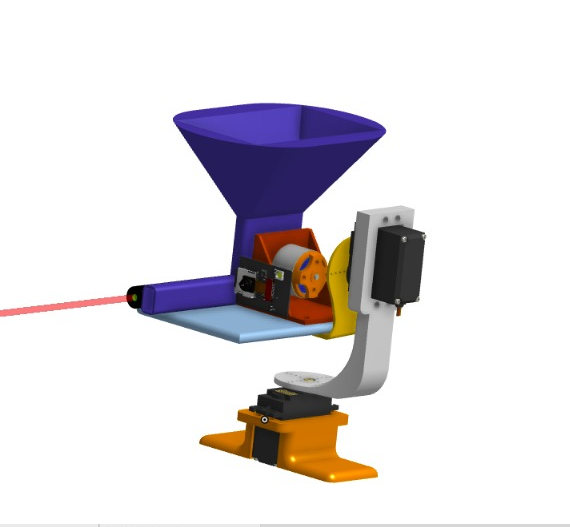

---
**Total Time Spent : 12hr**

---
---
#  June 26th — **7 Hours**

## 4:00 PM – 6:00 PM : Turret Circuit Design & Component Selection

I began by designing the basic working mechanism of the turret system, including how the pan and tilt movements will be working. After researching various options, I selected suitable components such as:

- Servos for pan/tilt movement  
- BLDC motor for Shooting pellets  
- ESP32-CAM for camera and control  
- Power supply

Using **Cirkit Designer**, I created the circuit design for the turret, Once completed, I added it to the GitHub repository.

###  Circuit Design Image:

---

##  6:00 PM – 11:00 PM : 3D CAD Design of Turret

Using **Onshape**, I designed the full 3D model of the turret. The model consists of **5 custom parts** and **4 assemblies** in total.
###  Designed Components:
- Base Mount  
- Rotating Base for Pan  
- Tilt Frame  
- Camera Plate  
- BLDC Motor Holder

After modeling, I exported the STEP files and uploaded them to the GitHub repository, along with rendered images.

###  Rendered Views:

  
  

---

#  June 27th — **5 Hours**

##  5:00 PM – 8:00 PM : ESP32-CAM Firmware Development

I developed custom firmware for the **ESP32-CAM** using the **Arduino IDE**, aiming to provide full control of the turret via a **Web User Interface**. The firmware integrates prebuilt libraries for servo control, motor management, and live camera streaming.

###  Features Implemented:
-  Web UI accessible over local Wi-Fi  
-  Servo Control for pan/tilt using PWM  
-  BLDC Motor Control  
-  Live Camera Feed from ESP32-CAM

The source code (`.ino`) and related files were uploaded to the repository.

---

##  8:00 PM – 10:00 PM : Final Documentation, BOM, and Repository Setup

I finalized the project by preparing essential documentation and organizing all files in the repository:

-  Created a **Bill of Materials (BOM)** after comparing multiple component vendors  
-  Wrote a detailed **README** including features, usage, and image references  
-  Compiled a **Project Journal** summarizing the design, development, and testing process  
-  Uploaded all critical files:  
  - Circuit design and schematic  
  - 3D models (STEP, PNGs)  
  - Firmware and libraries  
  - BOM and project notes

The repository is now complete and ready for demonstration, submission, or further development.

---
