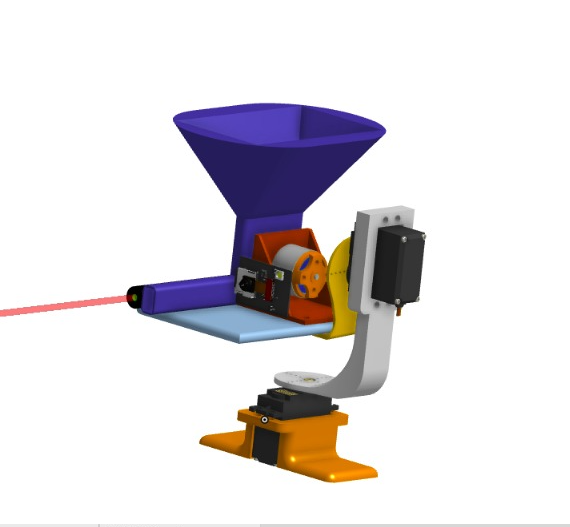
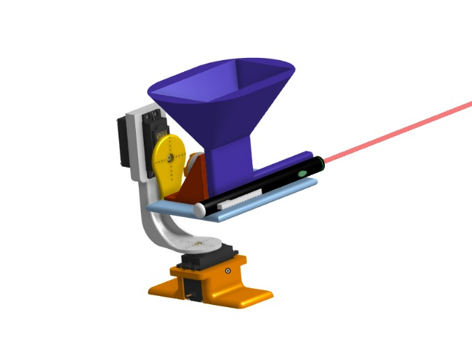
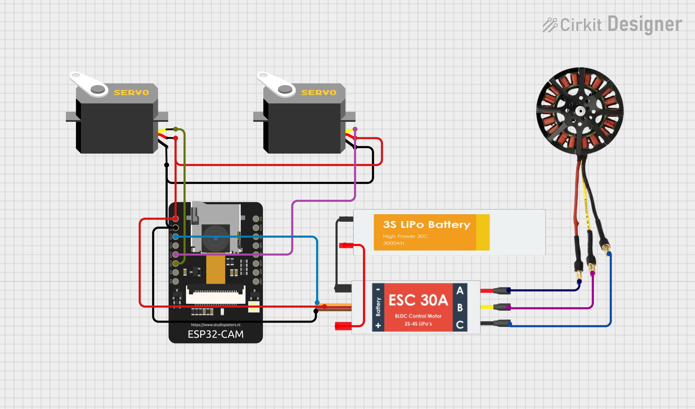

# Airsoft-Turrent 
Airsoft turret equipped with a live camera feed, full servo control, and a laser pointer for precise, 360-degree targeting and safe airsoft pellet firing made using custom 3d model.

# Features:
- Live Cam feed
- Full servo control
- Laser for aiming
- Harmless
- High Speed
- Low latency
- Strong build

# Purpose:
I made this project to explore pan and tilt mechanism in servos along with web interface for esp-cam.This turrent is primarily made for fun and *Harmlesss* pranks.

# Parts used :
- Esp32-Cam
- Metal Gear servos
- Bldc motor
- Esc 30A
- Li-Po Battery

# Images :
3d Model :

  
  

Wiring :

# BOM :
|Item     |Quantity|Price(USD)|Link |
|---------|--------|-----|-----|
|Esp32-Cam|    1   |6.93 |[Link](https://makerbazar.in/products/esp32-cam-development-board-wifi-bluetooth-with-ov2640-camera-module?variant=38389721858199)|
|Bldc motor|   1    | 4.69 |[Link](https://makerbazar.in/products/a2212-high-speed-brushless-dc-motor-bldc?variant=46570640376048)|
|Esc 30A   |   1    | 4.04 |[Link](https://makerbazar.in/products/simonk-30a-bldc-esc-electronic-speed-controller-with-dean-connectors?variant=46849072038128)|
|Servo MG99R |  2   |7.84|[Link](https://makerbazar.in/products/towerpro-mg996r-digital-high-torque-servo-motor?variant=47599618097392)|
|Battery 2200mah | 1 |19.02 |[Link](https://makerbazar.in/products/high-performance-11-1v-3s1p-lipo-battery?variant=47454607114480)|
|Usb to Uart  | 1 | 1.38|[Link](https://makerbazar.in/products/cp21026-pin-usb-2-0-to-ttl-uart-serial-converter?variant=42790917374192)|
|Battery Charger |1 |3.81|[Link](https://makerbazar.in/products/imax-b3-ac-compact-balance-charger-for-2s-3s-lipo?variant=43359945752816)|
|Servo Shield | 1 | 2.88|[Link](https://makerbazar.in/products/pca9685-16-channel-servo-motor-driver?variant=43866875035888)|
|             |   |        ||
|**Total**    | 9|$50.61||
